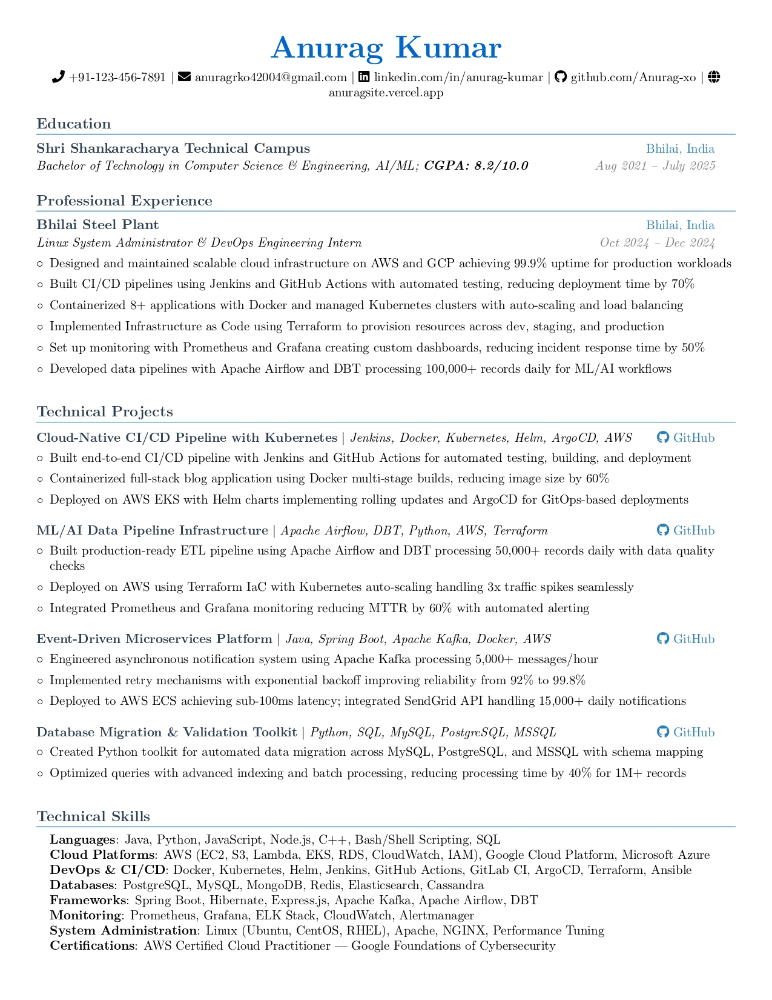

````md
# 🧾 Modern LaTeX Resume Template for Developers

A **clean, single-page, ATS-friendly LaTeX resume template** built for developers, DevOps engineers, and software professionals.  
Minimal, customizable, and designed to make your resume stand out — whether it’s for campus placements, tech startups, or FAANG interviews.



<p align="center">
  <a href="https://github.com/Anurag-xo/latex-resume/stargazers"></a>
  <a href="https://github.com/Anurag-xo/latex-resume/network/members"></a>
  <a href="https://github.com/Anurag-xo/latex-resume/issues"></a>
  <a href="LICENSE"></a>
</p>

---

## ✨ Features

✅ **ATS-Friendly Format** – Pass automated screeners with clean, structured LaTeX.  
✅ **Single-Page Layout** – Ideal for online applications and quick scans.  
✅ **Developer-Focused Sections** – Projects, Skills, Experience, and Education.  
✅ **Multiple Templates** – Choose from several layout styles (`devops_resume.tex`, `best_code.tex`, etc.).  
✅ **Docker Support** – Build easily without installing LaTeX locally.  
✅ **Fully Customizable** – Edit sections modularly for any role (DevOps, SWE, AI/ML, etc.).

---

## 🚀 Quick Start

### 🧱 Prerequisites

You’ll need a LaTeX distribution installed, such as:

```bash
sudo apt-get update && sudo apt-get install texlive-latex-recommended texlive-latex-extra texlive-fonts-recommended texlive-fonts-extra
```
````

---

### 🧰 Build Locally

1. **Clone the repo**

   ```bash
   git clone https://github.com/Anurag-xo/latex-resume.git
   cd latex-resume
   ```

2. **Compile your resume**

   ```bash
   pdflatex -output-directory=output src/main.tex
   ```

3. **View output**
   - The PDF will appear in the `output/` folder.

---

### 🐳 Build Using Docker (Recommended)

Don’t want to install LaTeX locally? Use Docker.

```bash
./build.sh
```

This builds the Docker image and compiles your `main.tex` automatically.

---

## 🧩 Customize Your Resume

### 🔧 Modify Content

- Edit `src/main.tex` to change your **name, title, and contact info**.
- Update section files in `src/sections/` (e.g., `experience.tex`, `projects.tex`) to match your data.

### 🎨 Change Template

Choose a different style from `src/templates/`:

```latex
\input{templates/devops_resume.tex}
```

Other options include:

- `best_code.tex`
- `minimal_resume.tex`
- `modern_resume.tex`

---

## 📄 Example Preview

| Template             | Screenshot                                  |
| -------------------- | ------------------------------------------- |
| **DevOps Resume**    |       |
| **Best Code Resume** |  |

👉 _(Optional: Add your own preview images for each template)_

---

## ☁️ Overleaf Version (Optional)

You can edit it online directly on Overleaf:
🔗 [Open in Overleaf](#) _(Replace with your Overleaf template link once published)_

---

## 🌱 Contributing

Contributions are **welcome**!
You can:

- Add new templates or styles 🎨
- Improve build scripts 🧩
- Fix bugs or formatting 🪲
- Share your customized versions 💼

1. Fork this repo 🍴
2. Create a new branch
3. Commit your changes
4. Submit a PR 🚀

---

## 🧠 Keywords

`latex resume`, `developer cv`, `modern resume template`, `ats resume`,
`overleaf resume`, `software engineer resume`, `devops resume`, `open source`

---

## 🪪 License

This project is licensed under the **MIT License**.
All personal data and example content belong to their respective authors.

---

<p align="center">
  ⭐ If you like this project, consider giving it a star — it helps more developers discover it!
</p>
```
