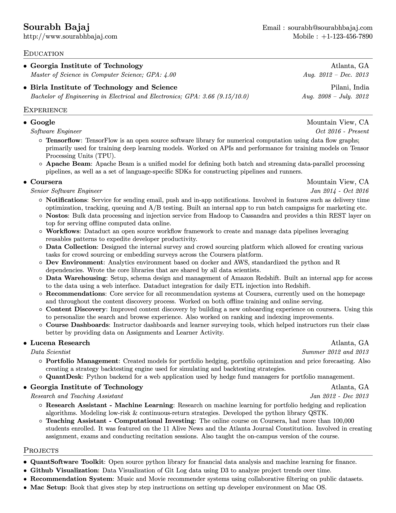

# LaTeX Resume

A single-page, one-column resume template for software developers, designed for ease of use and customization. This template uses standard LaTeX fonts and packages to ensure compatibility and a straightforward setup process.



## Features

- **Single-Column Layout:** Clean and simple one-column format, ideal for career fairs and online applications.
- **Consistent Formatting:** Uses custom LaTeX commands for consistent styling across all sections.
- **Easy to Customize:** Sections are clearly defined and can be easily added or removed.
- **Multiple Templates:** Comes with a variety of templates to choose from.
- **Docker Support:** Includes a Dockerfile and build script for a hassle-free, containerized build process.

## Getting Started

### Prerequisites

To build the resume locally, you'll need a LaTeX distribution installed on your system. The required packages are:

- `texlive-latex-recommended`
- `texlive-latex-extra`
- `texlive-fonts-recommended`
- `texlive-fonts-extra`

You can typically install these using your system's package manager. For example, on Debian/Ubuntu:

```bash
sudo apt-get update && sudo apt-get install texlive-latex-recommended texlive-latex-extra texlive-fonts-recommended texlive-fonts-extra
```

### Building the Resume

1.  **Clone the repository:**
    ```bash
    git clone https://github.com/your-username/latex-resume.git
    cd latex-resume
    ```

2.  **Compile the LaTeX source:**
    ```bash
    pdflatex -output-directory=output src/main.tex
    ```
    This will generate the resume PDF in the `output` directory.

## Usage

### Customizing Content

-   **Main File:** The main LaTeX file is `src/main.tex`. This is where you can set your name, contact information, and choose a template.
-   **Sections:** The resume content is organized into sections located in the `src/sections` directory. You can edit these files to add your own experience, education, and projects.

### Changing Templates

This repository includes several resume templates located in the `src/templates` directory. To use a different template, simply change the `\input` command in `src/main.tex` to point to the desired template file.

For example, to use the `devops_resume.tex` template, you would change:

```latex
\input{templates/best_code.tex}
```

to:

```latex
\input{templates/devops_resume.tex}
```

## Build using Docker

If you have Docker installed, you can build the resume without needing to install a local LaTeX distribution.

1.  **Build the Docker image and compile the resume:**
    ```bash
    ./build.sh
    ```

This script will build the Docker image and run the container to compile the `main.tex` file, with the resulting PDF saved in the `output` directory.

## Contributing

Contributions are welcome! If you have any suggestions, bug fixes, or improvements, please feel free to open an issue or submit a pull request.

## License

The format of this resume is licensed under the MIT License. However, all personal data and content in the resume belong to the original author.